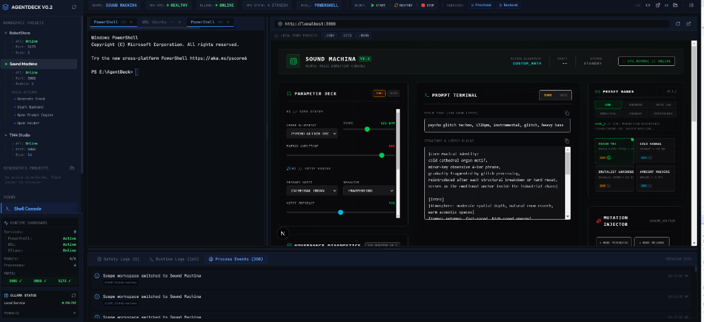

# AgentDeck

### Workspace Runtime Control Center for AI-Assisted Development

**Current version: v1.0.8** · see [`PROJECT_STATE.md`](PROJECT_STATE.md) for the full session-reload / current-state artifact and [`docs/roadmap.md`](docs/roadmap.md) for what's shipped vs. next.



AgentDeck is a desktop workspace orchestrator that combines terminals, local AI services, browser previews, runtime observability, and project control into a single operator console.

Built with Electron, React, TypeScript, xterm.js, and Node.js, AgentDeck provides a unified environment for managing local projects, AI workflows, VPS infrastructure, and development runtimes.

---

## Why AgentDeck?

Modern development workflows often require managing multiple tools simultaneously:
- **PowerShell** and **WSL** environments
- **SSH sessions** and remote connections
- **Local AI models** (Ollama) and vector pipelines
- **Development servers** and database watchdogs
- **Browser previews** and styling live reviews
- **Logs and diagnostics** stream viewports
- **Multiple project contexts** that switch layout demands

AgentDeck brings these capabilities together inside a single workspace-oriented control center, serving as a unified operations HUD.

---

## Current Capabilities (v1.0.8)

- **Terminal & Runtime Workspace** — native PowerShell/WSL/SSH terminals via `node-pty` with a self-healing `child_process.spawn` fallback; managed service start/stop/restart with Windows process-tree termination (`taskkill`).
- **Project Discovery & Manifest Editor** — auto-discovery via `.agentdeck/workspace.json` (schema v2, see [`docs/workspace-manifest-spec.md`](docs/workspace-manifest-spec.md)), an onboarding wizard, and a visual manifest editor with atomic, backed-up writes.
- **Agent Workspace** — directory-grounded agent sessions with multi-agent model bindings, plus the **Agent Topology Wizard**, which scans a project's structure to suggest agent roles automatically.
- **Evaluations Center** — benchmarks, regression runs, an approval queue, a failure library, gold standards, judges, and baseline promotion history.
- **Governance Center & Decision Evidence Packages (DEP)** — release-candidate policies and lifecycle, compliance rationale capture, chain-of-custody timeline, and exportable evidence packages.
- **Snapshots, Provenance & Doctor Diagnostics** — workspace state snapshots with restore, a provenance mutation ledger, and automated health checks with guided repairs.
- **Timeline & Replay** — an operator event log with replay of recorded workspace activity.
- **Browser Preview & Observability** — sandboxed live-preview panel, HTTP port health checks, and Ollama local-model status.
- **Safety Layer** — destructive-command detection, a confirmation gate, workspace-path traversal validation at the IPC boundary, and integrity checksums on governance/snapshot/provenance records (an unkeyed SHA-256 checksum — it detects accidental corruption and casual edits, not a determined tamperer; see [`docs/audit-remediation-backlog.md`](docs/audit-remediation-backlog.md) for the real-signing plan).
- **Platform** — Electron 43, Vite 8 / Vitest 4, electron-builder 26; `npm audit` at 0 vulnerabilities; 86 automated tests gating CI.

---

## Architecture

```
AgentDeck
│
├── Electron Desktop Shell (Chromium + Node.js Main thread)
├── React UI (Vite + Tailwind CSS render thread)
├── Workspace Runtime Engine
├── Terminal Manager (node-pty / spawn-fallback)
├── Process Manager (Zustand state + taskkill process tree)
├── Observability Layer (HTTP probes + local tag check)
├── Browser Preview (iframe viewports)
└── Local Persistence (layout.json + logs.json)
```

---

## Technology Stack

- **Desktop Framework**: Electron 43
- **UI Framework**: React + TypeScript + Tailwind CSS
- **Bundler & Tooling**: Vite 8 + PostCSS
- **Test Runner**: Vitest 4
- **Console Engine**: xterm.js + Fit Addon
- **Shell Linkage**: node-pty (Primary) / child_process.spawn (Fallback)
- **State Store**: Zustand
- **Packaging**: electron-builder 26 (NSIS)

---

## Workspace Manifest

Projects expose metadata and actions through `.agentdeck/workspace.json`. See [`docs/workspace-manifest-spec.md`](docs/workspace-manifest-spec.md) for the full schema (v2).

```json
{
  "schemaVersion": "agentdeck.workspace.v1",
  "name": "TM4 Studio",
  "previewUrl": "http://localhost:8000",
  "health": {
    "type": "http",
    "url": "http://localhost:8000/healthz"
  },
  "commands": [
    {
      "id": "start-api",
      "label": "Start API",
      "shell": "powershell",
      "command": "npm run dev"
    }
  ]
}
```

---

## Development

### Install Dependencies
```bash
npm install
```

### Run Development Environment
```bash
npm run dev
```

### Run Tests
```bash
npm test
```

### Production Build
```bash
npm run build
```

### Package Application
```bash
npm run dist
```

---

## Release History & Roadmap

Release-by-release detail lives in [`PROJECT_STATE.md`](PROJECT_STATE.md#release-log) (the single source of truth for what has shipped, kept current at every milestone). Forward-looking work — near-term candidates and longer-term deferred ideas — lives in [`docs/roadmap.md`](docs/roadmap.md).

At a glance, AgentDeck has shipped through:
- **v0.1–v0.6**: desktop foundation, discovery/probing, workspace runtime control, service orchestration, templates & manifest editor, packaging polish.
- **v1.0.0–v1.0.5**: Governance Center, Evaluations Center, Timeline & Replay, and Decision Evidence Packages (DEP).
- **v1.0.6–v1.0.7**: Agent Workspace Foundation and the Agent Topology Wizard.
- **v1.0.8 (current)**: audit remediation (test harness + CI gate, hardened command execution, honest integrity-checksum wording, IPC path validation) and the Electron 43 / Vite 8 / Vitest 4 / electron-builder 26 platform upgrade.

---

## Design Philosophy

AgentDeck is not intended to be another IDE. Instead, **it acts as a control layer above existing tools**:
1. Use your preferred editor (VS Code, Cursor, etc.).
2. Use your preferred AI.
3. Use your preferred terminal shell.

AgentDeck provides the operational workspace environment that connects them together.

---

## License

This project is licensed under the [MIT License](LICENSE).
