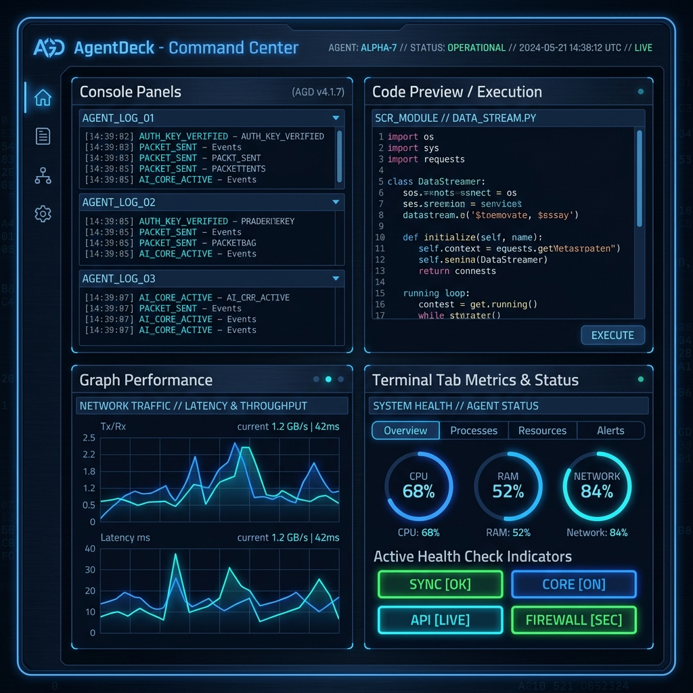

# AgentDeck

### Workspace Runtime Control Center for AI-Assisted Development



AgentDeck is a desktop workspace orchestrator that combines terminals, local AI services, browser previews, runtime observability, and project control into a single operator console. 

Built with Electron, React, TypeScript, xterm.js, and Node.js, AgentDeck provides a unified environment for managing local projects, AI workflows, VPS infrastructure, and development runtimes.

---

## Why AgentDeck?

Modern development workflows often require managing multiple tools simultaneously:
- **PowerShell** and **WSL** environments
- **SSH sessions** and remote connections
- **Local AI models** (Ollama) and vector pipelines
- **Development servers** and database watchdogs
- **Browser previews** and styling live reviews
- **Logs and diagnostics** stream viewports
- **Multiple project contexts** that switch layout demands

AgentDeck brings these capabilities together inside a single workspace-oriented control center, serving as a unified operations HUD.

---

## Core Features

- **Terminal Workspace**
  - Native PowerShell integration
  - WSL integration
  - SSH session support
  - xterm.js terminal rendering
  - Multiple concurrent terminal sessions
  - node-pty support with self-healing fallback adapters

- **Runtime Control**
  - Start workspace services
  - Stop running processes recursively (process tree termination)
  - Restart managed commands safely
  - Runtime process registry
  - Process lifecycle monitoring

- **Project Discovery**
  - Automatically discover projects using `.agentdeck/workspace.json`
  - Each project can define preview URLs, health check probes, startup command action lists, and workspace metadata.

- **Browser Preview**
  - Built-in local preview panel
  - Localhost support
  - Development server previews
  - Isolated workspace visualization

- **Observability**
  - Workspace health monitoring
  - API status indicators
  - Port availability checking
  - Ollama local GPU service checking
  - Runtime event tracking

- **Safety Layer**
  - AgentDeck includes command safety protections:
    - Dangerous command detection (e.g. `rm -rf`, `del`, `rmdir`, `git clean`)
    - Dialog interception gate
    - Backend validation
    - Safety audit logging

---

## Architecture

```
AgentDeck
│
├── Electron Desktop Shell (Chromium + Node.js Main thread)
├── React UI (Vite + Tailwind CSS render thread)
├── Workspace Runtime Engine
├── Terminal Manager (node-pty / spawn-fallback)
├── Process Manager (Zustand state + taskkill process tree)
├── Observability Layer (HTTP probes + local tag check)
├── Browser Preview (iframe viewports)
└── Local Persistence (layout.json + logs.json)
```

---

## Technology Stack

- **Desktop Framework**: Electron
- **UI Framework**: React + TypeScript + Tailwind CSS
- **Bundler & Tooling**: Vite + PostCSS
- **Console Engine**: xterm.js + Fit Addon
- **Shell Linkage**: node-pty (Primary) / child_process.spawn (Fallback)
- **State Store**: Zustand

---

## Workspace Manifest

Projects expose metadata and actions through `.agentdeck/workspace.json`.

```json
{
  "schemaVersion": "agentdeck.workspace.v1",
  "name": "TM4 Studio",
  "previewUrl": "http://localhost:8000",
  "health": {
    "type": "http",
    "url": "http://localhost:8000/healthz"
  },
  "commands": [
    {
      "id": "start-api",
      "label": "Start API",
      "shell": "powershell",
      "command": "npm run dev"
    }
  ]
}
```

---

## Development

### Install Dependencies
```bash
npm install
```

### Run Development Environment
```bash
npm run dev
```

### Production Build
```bash
npm run build
```

### Package Application
```bash
npm run dist
```

---

## Current Status & Roadmap

### v0.1: Desktop Foundation (Implemented)
- [x] Electron bootstrap & Vite hot-reload pipeline
- [x] React UI layout presets
- [x] Terminal integration (PowerShell, WSL)
- [x] Sandboxed browser preview iframe
- [x] Paste/interactive command safety checks

### v0.2: Discovery & Probing (Implemented)
- [x] Native folder directory picker & auto-discovery
- [x] Automatic manifest generation (`.agentdeck/workspace.json`)
- [x] API health polling & Ollama GPU service checking
- [x] High-density split dashboard layout

### v0.3: Workspace Runtime Control (Implemented)
- [x] Process registry for managed actions
- [x] Safe command start / stop / restart sequences
- [x] Windows process-tree recursive termination (`taskkill`)
- [x] Safety, Process Events, and scrolling Runtime logs tabs
- [x] Pre-checked resilient VS Code, Cursor, and Folder launchers
- [x] Self-healing ConPTY terminal launch fallbacks

### v0.4: Orchestration (Planned Roadmap)
- [ ] Workspace template presets
- [ ] Multi-command service groupings
- [ ] Concurrent action flows
- [ ] Runtime workspace snapshots

### v0.5: Agent Workspace Integration (Planned Roadmap)
- [ ] Local LLM execution context logs
- [ ] Ollama models management HUD
- [ ] Agent code generation execution monitoring

### v1.0: Enterprise HUD (Planned Roadmap)
- [ ] Plugin extension registry
- [ ] Shared team workspace configurations
- [ ] Remote runtime dashboard

---

## Design Philosophy

AgentDeck is not intended to be another IDE. Instead, **it acts as a control layer above existing tools**:
1. Use your preferred editor (VS Code, Cursor, etc.).
2. Use your preferred AI.
3. Use your preferred terminal shell.

AgentDeck provides the operational workspace environment that connects them together.

---

## License

This project is licensed under the [MIT License](LICENSE).
