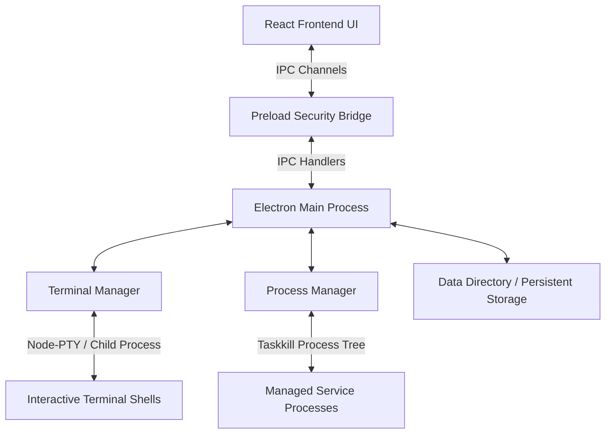

# AgentDeck Architecture

AgentDeck is constructed as a dual-layer desktop workspace controller. It leverages Electron's secure multi-process architecture to decouple high-risk system operations (shell spawning, process-tree termination) from the React rendering interface.

---

## 1. Multi-Process Layering

### Electron Main Process (`electron/main.ts`)
- Serves as the system-privileged supervisor.
- Spawns and manages the Chromium window context.
- Orchestrates general IPC router endpoints (`dialog:open-directory`, `workspace:load-path`, `port:check-health`, `ide:open`).
- Shuts down all active process tree structures upon application exit.

### Preload Layer (`electron/preload.ts`)
- Acts as a unidirectional, selective security gateway.
- Uses `contextBridge` to expose a curated window API object (`window.api`) to the renderer thread.
- Restricts arbitrary Node.js API execution inside the frontend Chromium environment (no direct access to `fs`, `child_process`, or raw TCP sockets).

### Shared Backend Logger (`electron/logger.ts`)
- Prevents circular import dependencies between `main.ts`, `terminalManager.ts`, and `processManager.ts`.
- Manages real-time log parsing, writes safety and runtime event details to `data/logs.json`, and emits the `logs:changed` event to notify the React frontend UI store of updates.

---

## 2. Shell & Terminal Adapters

### Terminal Manager (`electron/terminalManager.ts`)
- Coordinates the lifecycle of all terminal sessions.
- Spawns either interactive terminals or managed process shells and tracks their associated terminal session IDs.
- Routes inbound character input (pasted blocks, standard keyboard inputs) and returns outbound console text streams to xterm.js components.
- Implements **Self-Healing Fallbacks**: If `node-pty` fails to load or crashes on startup due to ConPTY issues (returning exit code `-1073741510` within the first 2 seconds), the manager automatically regenerates the terminal tab scope using the fallback `SpawnAdapter` and posts a system log warning.

### Terminal Adapters (`electron/terminalAdapters/`)
- **`interface.ts`**: Standardizes the interface methods for terminal execution adapters (`write`, `resize`, `kill`, `onData`, `onExit`, `getPid`).
- **`nodePtyAdapter.ts`**: High-performance, native C++ terminal connector linking directly to ConPTY on Windows or PTY on Unix systems.
- **`spawnAdapter.ts`**: Fallback adapter utilizing `child_process.spawn`. Normalizes interactive inputs to stdin, maps stdout/stderr channels, and logs fallback notices.

---

## 3. Runtime Controls

### Process Manager (`electron/processManager.ts`)
- Maintains the local `ManagedProcess` registry mapping all service commands started from the frontend.
- Captures native OS PIDs from terminal adapters.
- Employs process-tree termination routines on Windows:
  `taskkill /F /T /PID <pid>`
  This recursively kills all spawned child nodes (e.g. stopping a concurrently dev server will kill its spawned node-pty shell, standard Node/Vite process, and file watcher threads simultaneously to prevent port leakage).
- Broadcasts real-time state change updates to the React Zustand store via `process:state-changed` IPC streams.

---

## 4. Safety Gates & Observability

### Command Safety Gate (`electron/commandSafety.ts` & `src/lib/commandSafety.ts`)
- **Dual-Verification**: Validates commands on both the frontend UI and backend terminal input channels to prevent safety bypasses.
- Parsers scan inputs against destructive regex patterns (e.g. `rm -rf`, `del`, `rmdir`, `git clean`) and absolute navigation sequences trying to exit the designated workspace scope path (e.g. trying to inspect system paths).
- Interrupts execution and displays a modal dialog when flagged. If confirmed, the command is temporarily whitelisted for 5 seconds before expiring.

### Observability Layer
- **HTTP/TCP Prober**: Conducts non-blocking port health queries on workspace `previewUrl` targets (like `http://localhost:8000`), updating port connectivity status lights in real-time.
- **Ollama tag checker**: Queries local LLM service tags to verify connectivity states and populate active model selections.
