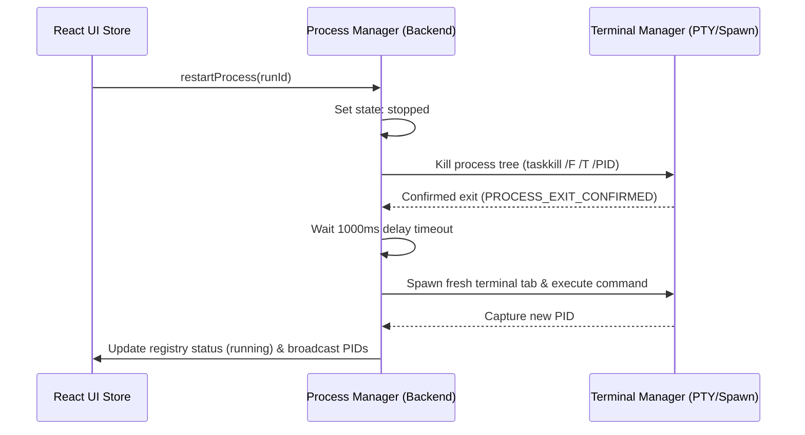

# Process Runtime Model

AgentDeck maintains a strict architectural separation between user-driven interactive terminal shells and system-managed background runner commands. This division guarantees workspace isolation, process predictability, and safe runtime termination.

---

## 1. Terminal Session Classifications

### Interactive Terminals (User-Controlled)
- **Instantiated by**: Presets defined in `.agentdeck/workspace.json` under `terminals`, or via the manual "New Tab" button.
- **Identifier format**: `term-[workspaceId]-[sessionName]`
- **Runtime Scope**: Spawns an interactive shell process (PowerShell, WSL, bash, SSH). The user has complete control over typed characters, command chains, and sub-processes.
- **Lifecycle**: Interactive sessions are **terminated** automatically when switching workspaces to keep resources clear.
- **Process Registry Status**: **Excluded**. These do not enter the Zustand process store or the backend process status registry. They do not get Play/Stop/Restart UI controls.

### Managed Process Runs (System-Tracked)
- **Instantiated by**: Explicit user clicks on action buttons (e.g. `Start API`) located on the top dashboard strip.
- **Identifier format**: `run-[workspaceId]-[commandId]-[timestamp]`
- **Runtime Scope**: Runs a specific, discrete workspace command inside a dedicated xterm.js tab panel.
- **Lifecycle**: **Preserved**. When switching workspace scopes, managed process runs are left running in the background to ensure local APIs/workers remain alive. Their console tabs remain active across switches.
- **Process Registry Status**: **Included**. They are fully mapped in the Zustand store and the backend `ProcessManager` registry. They display real-time status indicators (`starting` | `running` | `stopped` | `failed`) and receive dedicated Stop/Restart controls.

---

## 2. Process Tree Termination (`taskkill`)

When stopping a managed process on Windows, calling standard Node.js process `.kill()` signals only terminates the wrapper script process. In development, child processes (like file-watchers, node-inspector modules, and compiler threads) frequently orphan and lock up listening TCP ports.

To solve this, AgentDeck issues a force-kill instruction down the entire process branch:
```powershell
taskkill /F /T /PID <pid>
```

### IPC Logging Contract
All taskkill attempts and exit confirmations must generate explicit audit trails. This lets the user see exactly when processes are requested to stop and when they are confirmed terminated:
1. `PROCESS_STOP_REQUESTED`: Sent immediately when the user clicks the Stop button. Updates the registry status to `stopped`.
2. `PROCESS_TREE_KILLED`: Sent when `taskkill` reports successful execution of the tree-killing routine.
3. `PROCESS_EXIT_CONFIRMED`: Sent when the backend terminal adapter confirms process exit and releases the associated session tab.

---

## 3. Safe Sequential Restart Sequence

When the user requests a command restart, a sequential series of lifecycle hooks executes to guarantee the port is released before a new listener attempts to bind:


This sequential loop prevents race conditions where a restarted dev server fails to launch because its previous instance is still releasing the listening TCP port.
